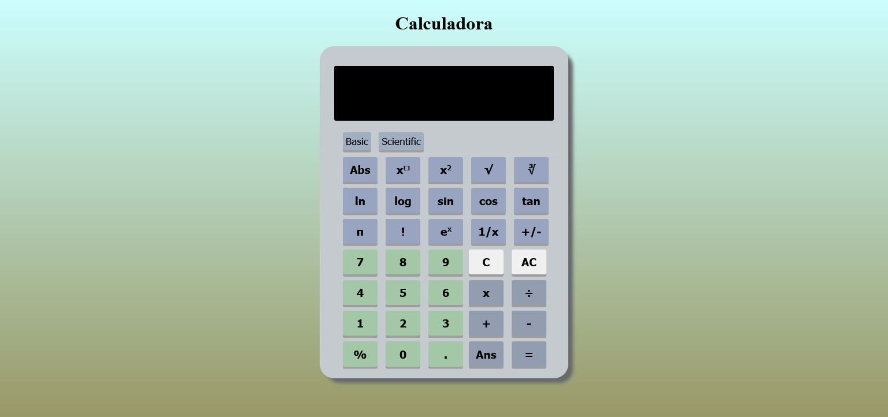

 # Práctica 2
[Calculadora](https://nirtika.github.io/2020-2021-CSAAI-Practicas/P2/) 

Las expresiones a calcular deben ser de la forma: [Número Operador Número].

No permite hacer operaciones de mas de dos números (2+2+2), para hacer cálculos de más de dos números primero hay que hacer de 2 números y darle a igual y continuar.

No permite dos puntos '.' o operadores seguidas.

Hay un botón para elegir Versión basica o la científica.

Por defecto se abre la basica.

Realiza las operaciones básicas  de suma, resta, multiplicación , división , calcular porcentaje.

El botón 'AC' borra todos los números introducidos y el botón 'C' borra el último carácter introducido.

EL botón ANS devuelve el último resultado calculado.

    MEJORAS:
        Calculadora científica:
            Permite realizar los siguientes calculos: log, ln, trigonometricas (sin, cos, tan), factorial, pi , raíz caudarada y cubica  etc.
            Para calcular pi [Número/pi  Operador Número/pi].
            Para calcular sin, cos, tan, ln , log etc.. primero hay que introducir los números y luego seleccionar la función. 
                Ejemplo para calcular seno de 30 :
                    Hay que introducir primero el número 30 y luego pulsar el botón de seno.
        
        En caso de algunos de los errores muestra el Syntax Error en el display.
    
