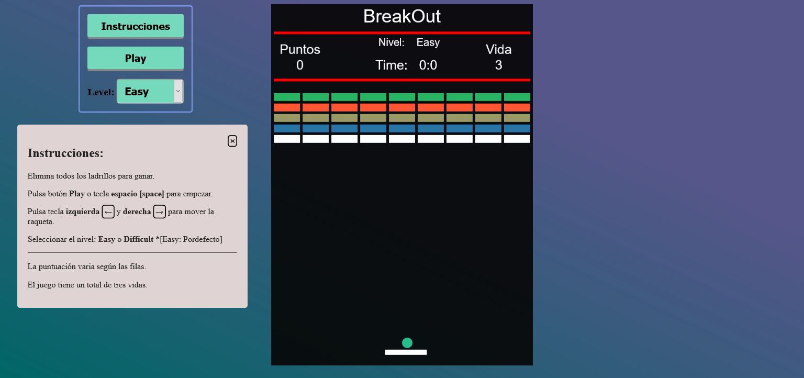

# Práctica 3

[Juego BreakOut](https://nirtika.github.io/2020-2021-CSAAI-Practicas/P3/)

ESPECIFICACIONES:

La raqueta se mueve con las teclas izquierda y derecha del teclado.

Inicio del Juego : El botón play o pulsando la tecla espacio (space).

El juego tiene un total de 3 vidas.

Cada vez que no se consiga golpear la bola con la raqueta el jugador perderá una vida.

Se pierde el juego cuando se pierde todas las vidas (vida = 0).

Hay un total de 45 ladrillos (9 columnas y 5 filas).

Para ganar hay que destruir todos los ladrillos.

    MEJORAS:
        1.  Sonidos para la destrucción de los ladrillos, cuando se pierde
            una vida, rebote en la raqueta y cuando se pierde / gana el juego.

        2.  Puntuación variable de los ladrillos: Los situados más arriba
            tendrán puntuaciones mayores que los de las primeras filas.
                [- puntos : 10 , 5 , 2 y 1 ]

        3. Diferente color de los ladrillos según la fila.

        4. Cronómetro: Se para cuando gana / pierde el juego.

        5. Velocidad aleatorio de la bola cada vez que rebota en la raqueta.

        6. Cambio de color de la bola cada vez que rebota en la raqueta y se pierde la vida.

        7. Niveles:
            Hay dos niveles: Fácil y Difícil

            El nivel establecido por defecto es el nivel Fácil.

            En el nivel Difícil cada vez que se pierde una vida los ladrillos destruidos
            vuelven a su posición inicial Y se restan los puntos dependiendo de los puntos obtenidos.
                Los puntos obtenidos: mayor que 5 se resta 5 puntos
                                      menos o igual que 5 se resta 1 punto cada veza que se pierde una vida.

