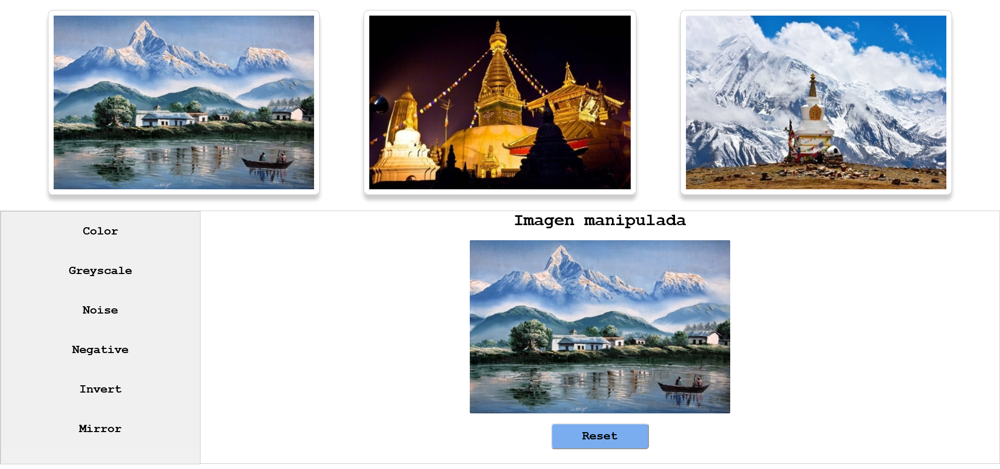

 # Práctica 4
[Manipulación de imágenes](https://nirtika.github.io/2020-2021-CSAAI-Practicas/P4/)

Hay que seleccionar una de las 3 imagenes para aplicar los filtros.

    Funcionamiento Básico
        Filtro de grises y Escala de Colores (RGB).
        Los deslizadores (RGB) solo aparecerán una vez pulsado el botón de color.

Hay un botón Reset para volver a imagen original. 

    MEJORAS: 
            Filtro ruido (Noise) 
            Filtro negativo (Negative)
            Filtro Invertir (Invert)
            Filtro Espejo (Mirror)

