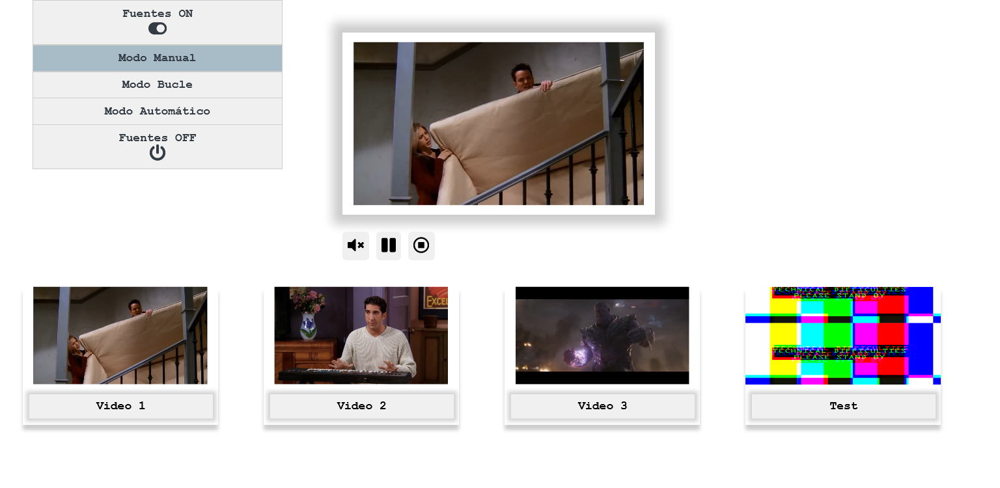

# Práctica 5

[Realizador de TV](https://nirtika.github.io/2020-2021-CSAAI-Practicas/P5/)

Hay 4 fuentes, 3 de video y una imagen de emisión.

Botón Fuentes ON: Encender las cámaras

Boton Fuentes OFF: Apagar las cámaras.

Primero hay que encender las cámaras y seleccionar el modo (Manual/Bucle/Automático), luego seleccionar los vídeos para realizar la emisión.

Funcionamiento básico: Modo Manual

Los vídeos utilizados estan subidos en el Repositorio [ VIDEOS_2020-2021-CSAAI-Practicas ](https://github.com/nirtika/VIDEOS_2020-2021-CSAAI-Practicas)

    MEJORAS: 
        1. Modo Bucle
            Si se activa este modo, cada vez que se selecciona una fuente,se reproduce sólo durante 2 segundos y
            se vuelve atrás (2 segundos),repitiéndose ese trozo de dos segundos en bucle, constantemente.
                Hay un botón para activar y desactivar el bucle.

        2.Modo automático
            Si se está en este modo, se retransmiten 3 segundos de cada cámara, alternativamente.
            Los botónes de selección de los videos no funcionan.
            Al apretar el botón de modo manual, se vuelve al modo normal.

        2. Botón para silenciar y activar el sonido.
        3. Botón para pausar, reproducir y parar la emisión. Cuando la emisión esta pausado o parado se muestra
            la imagen de pruebas en la pantalla.

